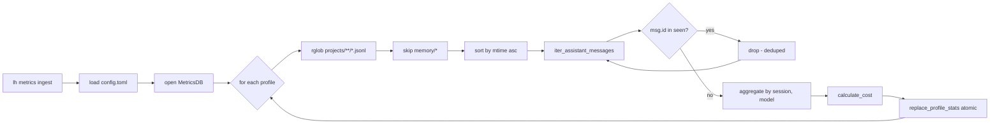

# How the metrics ingest pipeline works

`lh status` shows sessions, tokens, and cost by reading a SQLite database at `~/.config/lazy-harness/metrics.db` (or wherever `[monitoring].db` points). That database does not populate itself — something has to parse the agent's session JSONLs and feed it. That something is the **metrics ingest pipeline**: a standalone module (`lazy_harness.monitoring.ingest`) exposed as `lh metrics ingest`, designed to produce numbers that reconcile with `npx ccusage` without ever double-counting tokens.

This page explains what the pipeline does, how it guarantees precision, and how to wire it into the scheduler so `lh status` stays live.

## Producer and sink

Two pieces are needed on either side of the pipeline:

- **Producer** — `lazy_harness.monitoring.collector.iter_assistant_messages()` yields one dict per `type=="assistant"` entry in a JSONL file. Each dict carries the upstream `message.id`, the model string, and the four token buckets (`input_tokens`, `output_tokens`, `cache_read_input_tokens`, `cache_creation_input_tokens`). Messages without a `usage` block are skipped. When a legacy record has no `message.id`, the producer falls back to a synthetic id derived from the file stem and line number so dedup still works.
- **Sink** — `lazy_harness.monitoring.db.MetricsDB` owns the SQLite file. `session_stats` is keyed by `UNIQUE(session, model)` and stores per-bucket token counts plus a pre-computed cost. `replace_profile_stats(profile, entries)` wraps a `DELETE … WHERE profile=?` and a batch of `INSERT`s inside a single transaction, so a partially-failed ingest never leaves the profile in a half-written state.

## The walk

`ingest_all(cfg, db, pricing)` iterates every configured profile via `list_profiles(cfg)`. For each profile it calls `ingest_profile(profile, db, pricing)` which:

1. Resolves `<config_dir>/projects/` and skips profiles whose dir doesn't exist.
2. Collects every `*.jsonl` under `projects/` **recursively** (`rglob`), including nested subagent files at `<session-uuid>/subagents/agent-*.jsonl`. Paths that sit under a `memory/` ancestor are excluded — those are user-owned episodic logs (`decisions.jsonl`, `failures.jsonl`), not agent transcripts.
3. Sorts the collected files by `st_mtime_ns` ascending. Older files attribute their messages first, so the canonical ownership is stable across runs.
4. Iterates the files in order, maintaining a `seen_msg_ids: set[str]` across the whole profile. Each assistant message's id is checked against the set; novel messages bump an in-memory aggregator keyed by `(session_id, model)`; already-seen messages are counted as deduped and dropped.
5. After the walk, the in-memory aggregator is priced via `calculate_cost()` (per model × per token bucket, rates from `DEFAULT_PRICING` plus any `[monitoring.pricing]` override) and handed to `replace_profile_stats(profile.name, entries)`. The old rows for that profile are atomically replaced.

The whole pass is summarized as an `IngestReport` with the following counters: `sessions_scanned`, `sessions_updated`, `sessions_skipped`, `messages_total`, `messages_deduped`, and any per-file `errors`. `lh metrics ingest` prints the headline counters as the last line of output.



## Why it can't double-count

Three independent guarantees stack up:

### 1. Message-id dedup across files

When Claude Code `/resume`s a conversation, it writes a **new** JSONL whose first section re-includes every prior message. Without dedup, the shared prefix gets counted once per resume chain — for a conversation resumed four times, that's 5× overcounting.

The pipeline defends against that with `seen_msg_ids`: each upstream `message.id` is attributed to exactly one `(session_id, model)` bucket — the first one the walk sees it in, which is the oldest file by mtime. Every subsequent occurrence in a resumed JSONL is skipped and counted under `messages_deduped`.

In production this matters a lot: on the author's install, ~50% of assistant messages in `~/.claude-*` projects are duplicates introduced by resumes. Dedup is the difference between matching `ccusage` and being off by ~3×.

### 2. Append-only source of truth

Claude Code only ever appends to an existing session JSONL, never rewrites past messages. So re-parsing the full file always returns the exact cumulative totals as of now — not a delta, not a snapshot — and re-attributing them via dedup is idempotent by construction.

### 3. Atomic profile replace

`replace_profile_stats()` wraps its `DELETE` + `INSERT`s in a single `BEGIN … COMMIT`. A crash mid-transaction rolls back; the user's previous totals remain visible to `lh status`. A crash before the commit just means the next tick reconciles.

## Pricing

`DEFAULT_PRICING` in `monitoring/pricing.py` holds per-million-token rates for the three Claude models currently observed in the wild (`claude-opus-4-6`, `claude-sonnet-4-6`, `claude-haiku-4-5-20251001`). The rates mirror what LiteLLM publishes in `model_prices_and_context_window.json`, which is also what `ccusage` consumes — keeping the two aligned is the only way the cost numbers on `lh status` reconcile with `npx ccusage`.

You can override any model's rates per-install under `[monitoring.pricing]` in `config.toml`:

```toml
[monitoring.pricing."claude-opus-4-6"]
input = 5.0
output = 25.0
cache_read = 0.5
cache_create = 6.25
```

Overrides are merged over `DEFAULT_PRICING` at ingest time via `load_pricing()`.

## Precision tests

The pipeline is covered by `tests/unit/test_ingest.py`. The invariants worth calling out:

- `test_ingest_profile_upserts_totals` — happy path: one session, one ingest, one row with the right totals.
- `test_ingest_is_idempotent` — running ingest twice yields identical stored totals, no doubling.
- `test_ingest_reflects_session_growth` — append a new assistant turn to the JSONL, re-ingest. The stored row reflects the **new total**, not old+new.
- `test_ingest_dedups_messages_shared_across_resumed_sessions` — two files share a `message.id`; it is counted exactly once.
- `test_ingest_discovers_subagent_files` — nested `<uuid>/subagents/agent-*.jsonl` files are found and counted.
- `test_ingest_skips_memory_jsonls` — `memory/decisions.jsonl` and `memory/failures.jsonl` are ignored even if they happen to contain assistant-shaped lines.
- `test_ingest_isolates_profiles` — two profiles with different sessions don't contaminate each other.

If any of these break, the numbers in `lh status` stop being trustworthy. They run on every `uv run pytest`.

## Running it on a schedule

The harness already has a scheduler abstraction (`lh scheduler`) that bridges `[scheduler.jobs.*]` entries in `config.toml` to launchd plists on macOS and cron on Linux. The metrics ingest is a normal job entry — no special support needed. A typical setup:

```toml
[scheduler.jobs.metrics-ingest]
schedule = "*/15 * * * *"
command = "/Users/you/.local/bin/lh metrics ingest"
```

Then `lh scheduler install` to register the job with the platform backend and `lh scheduler status` to confirm it is loaded. Because the pipeline rebuilds each profile's stats from scratch and the file reads are cheap, a shorter cadence is only bounded by how fresh you want `lh status` to be.

Pair this with whatever manual ingest you want: running `lh metrics ingest` at the end of a noisy day gives the same final state as letting the cron tick through the day on its own. The pipeline is deterministic.

## When you should **not** use a hook

A tempting alternative is to ingest from the `Stop` / `session-export` hook so the DB updates instantly when a session closes. The reason the harness ships with a CLI + cron instead is decoupling: a SQLite write failure inside a hook would leak into the agent's perceived session cleanup, and the hook runs even when monitoring is disabled. Keeping ingest out-of-band means a broken ingest never breaks a session.

If you want live updates anyway, nothing stops you from calling `lh metrics ingest` from a local post-stop hook — just accept that you own the failure mode.

## The sink layer

Ingest writes session-level rollups (`session_stats`) to one SQLite file. The sink layer is the orthogonal channel for **per-event telemetry** — one record per assistant message, fan-out to one or more destinations. This is what the framework uses to ship metrics to a remote backend, with on-disk buffering and retry, without coupling the ingest pipeline to any of it.

### Built-in sinks

Two sinks ship with the framework:

| Sink | When it writes | What it does |
|---|---|---|
| `sqlite_local` | Always on | Upserts each `MetricEvent` into `session_stats` keyed by `(session, model)`. Identity columns (`user_id`, `tenant_id`) are stamped on every row. Never fails under normal conditions. |
| `http_remote` | Opt-in | Serializes the event as JSON, enqueues it on a persistent `sink_outbox` table. The actual HTTP POST happens later, in batches, via `drain_http_remote`. |

The list of active sinks is declared in `[metrics].sinks`. With no `[metrics]` block, the default is `["sqlite_local"]` and the framework does zero network I/O — that property is load-bearing for offline-friendly setups, so adding a new built-in sink that talks to the network without an explicit opt-in is rejected by the config parser.

### Why an outbox

`http_remote.write()` does not POST. It only enqueues. Three reasons:

1. **Hooks must be fast.** A `Stop` hook that blocks on a 5-second HTTP timeout drags out every session close. Enqueue is microseconds.
2. **Network is unreliable.** A failed POST should not lose the event. Persisting to SQLite first means the worst case is "send later", not "send never".
3. **Multiple `lh` processes.** Two terminals running `lh` in parallel both ingest, both enqueue. Without an outbox, both would also send — duplicating events on the backend.

The outbox solves (3) with a **claim-with-lease** protocol: when a worker drains a batch, it stamps a 60-second lease on those rows. Other `lh` processes skip leased rows. If a worker crashes mid-send, the lease expires and the next drainer picks them up.

### Drain — when and how

Two triggers fire `drain_http_remote`:

1. **Opportunistic.** Every `lh metrics ingest` drains after it ingests, in the same process. This means the cron-driven ingest cadence is also the drain cadence, with no extra wiring.
2. **Explicit.** `lh metrics drain` runs only the drain phase. Useful for catching up after a backend outage without re-running the full ingest.

The drainer iterates the claimed batch, POSTs each event, and writes back per-row state:

| Outcome | Action |
|---|---|
| HTTP 2xx | Mark `sent`. Row is removed from pending. |
| HTTP non-2xx | Mark `failed` with `error="HTTP <code>"`. Row stays pending; `attempts` increments; next-retry timestamp set with exponential backoff. |
| Network error / timeout | Same as non-2xx, with `error=<exception class>`. |

Backoff per row: first failure waits 1 s, then doubles, capped at 300 s. The cap means an event genuinely stuck on a broken backend retries every 5 minutes forever — up to whatever `[metrics].pending_ttl_days` you set, after which expired rows are pruned.

End-to-end idempotency comes from the `event_id` field on every `MetricEvent`. The receiving backend is expected to upsert by it. Re-sending after a crash mid-POST is therefore safe.

### Configuration

Minimal — `sqlite_local` only, no remote shipping:

```toml
# (no [metrics] block at all)
```

With remote shipping:

```toml
[metrics]
sinks = ["sqlite_local", "http_remote"]
user_id = "team-42"           # stamped on every event row
tenant_id = "acme"            # stamped on every event row
pending_ttl_days = 30         # outbox rows older than this are pruned

[metrics.sink_options.http_remote]
url = "https://metrics.example.com/v1/ingest"
timeout_seconds = 5.0         # per request
batch_size = 50               # events claimed per drain pass
```

Validation rules (enforced by the config parser):

- A name in `sinks` other than `sqlite_local` **requires** a matching `[metrics.sink_options.<name>]` block. Missing options is a hard error at load time.
- A `[metrics.sink_options.<name>]` block whose name is not in `sinks` is silently ignored (dead config).
- `http_remote` rejects an empty `url`.

The legacy `[monitoring]` block (`db`, `pricing`) is independent of `[metrics]`. They coexist: `[monitoring]` controls the SQLite file's location and pricing rates for ingest cost rollups; `[metrics]` controls per-event fanout. A future migration may unify them; today they live side by side.

### Health

`lh metrics status` prints per-sink counts (`pending` / `sending` / `sent`) so a stuck `http_remote` is visible without inspecting the DB:

```bash
$ lh metrics status
http_remote  pending: 12  sending: 0  sent: 8431
```

For deeper inspection:

```bash
sqlite3 ~/.config/lazy-harness/metrics.db <<'SQL'
SELECT sink_name, COUNT(*) AS rows, SUM(attempts) AS retries
FROM sink_outbox
WHERE status = 'pending'
GROUP BY sink_name;
SQL
```

## Pointers

- Pipeline: `src/lazy_harness/monitoring/ingest.py`
- Producer: `src/lazy_harness/monitoring/collector.py`
- Sink + schema: `src/lazy_harness/monitoring/db.py`
- Pricing table: `src/lazy_harness/monitoring/pricing.py`
- Sinks: `src/lazy_harness/monitoring/sinks/{sqlite_local,http_remote,worker}.py`
- Sink wiring: `src/lazy_harness/monitoring/sink_setup.py`
- Sink contracts (`MetricEvent`, `SinkWriteResult`, `DrainResult`, `SinkHealth`): `src/lazy_harness/plugins/contracts.py`
- CLI: `src/lazy_harness/cli/metrics_cmd.py`
- Tests: `tests/unit/test_ingest.py`, `tests/unit/test_pricing.py`, `tests/integration/test_metrics_cmd.py`
