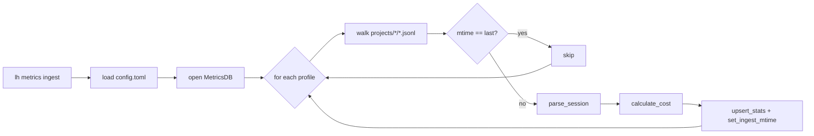

# How the metrics ingest pipeline works

`lh status` shows sessions, tokens, and cost by reading a SQLite database at `~/.config/lazy-harness/metrics.db` (or wherever `[monitoring].db` points). That database does not populate itself — something has to parse the agent's session JSONLs and feed it. That something is the **metrics ingest pipeline**: a standalone module (`lazy_harness.monitoring.ingest`) exposed as `lh metrics ingest`, designed to be safe to run on a cron without ever double-counting tokens.

This page explains what the pipeline does, how it guarantees precision, and how to wire it into the scheduler so `lh status` stays live.

## Producer and sink already existed

Before the ingest pipeline, two halves of the path were already in place:

- **Producer** — `lazy_harness.monitoring.collector.parse_session()` walks a single JSONL file, keeps only `type=="assistant"` entries, and aggregates `usage.input_tokens`, `usage.output_tokens`, `usage.cache_read_input_tokens`, and `usage.cache_creation_input_tokens` per model. The session's date is taken from the first `timestamp` field found. The session id is the file's stem (a UUID).
- **Sink** — `lazy_harness.monitoring.db.MetricsDB` owns the SQLite file. It has a `session_stats` table keyed by `UNIQUE(session, model)` plus an `ingest_meta` table keyed by `session` that stores the last-seen file mtime (in nanoseconds).

What was missing was the thing that walked the producer over every profile and wrote into the sink. That is what `ingest.py` adds.

## The walk

`ingest_all(cfg, db, pricing)` iterates every configured profile via `list_profiles(cfg)`. For each profile it calls `ingest_profile(profile, db, pricing)` which:

1. Resolves `<config_dir>/projects/` and skips profiles whose dir doesn't exist.
2. Iterates each `<project_slug>/` under `projects/`. The slug is decoded back into a human project name via `extract_project_name()` (reverses the agent's `-Users-foo-repos-demo` style encoding).
3. For every `*.jsonl` under the project dir, it `stat()`s the file to get `st_mtime_ns`.
4. **mtime fast path**: if `db.get_ingest_mtime(session)` equals the current `st_mtime_ns`, the session is skipped without re-parsing. Because the agent only ever appends to these files, an unchanged mtime means unchanged content.
5. Otherwise it calls `parse_session()`, prices each `(model, totals)` row using `calculate_cost()`, and `upsert_stats()`s the results. Then it stores the new mtime in `ingest_meta`.

The whole pass is reported back as an `IngestReport` with four counters: `sessions_scanned`, `sessions_updated`, `sessions_skipped`, `errors`. `lh metrics ingest` prints them as the last line of output.



## Why it can't double-count

Three independent guarantees stack up:

### 1. Append-only source of truth

Claude Code writes each session as a single JSONL file it only ever appends to. So `parse_session()` over the full file always returns the exact cumulative totals for that session as of now — not a delta, not a snapshot, but the absolute truth of what that session consumed end-to-end.

### 2. UPSERT by `(session, model)`

`MetricsDB.upsert_stats()` issues an `INSERT … ON CONFLICT(session, model) DO UPDATE SET …` that **overwrites** `input_tokens`, `output_tokens`, `cache_read`, `cache_create`, and `cost` with the freshly parsed totals. It does not `SUM`, it does not accumulate. Ingesting the same session five times produces the same numbers as ingesting it once.

### 3. mtime deduplication

Even without guarantee #2, the mtime fast-path would prevent re-parse on cron ticks where nothing changed. This is a throughput optimization, not the correctness mechanism — the correctness comes from UPSERT — but it matters in practice because a cron that fires every 15 minutes would otherwise re-parse hundreds of sessions on every tick.

The combination means you can safely run `lh metrics ingest` from any number of places — a cron, a session-stop hook, an interactive shell — without worrying about drift.

## Precision tests

The pipeline is covered by `tests/unit/test_ingest.py`. The four invariants worth calling out:

- `test_ingest_profile_upserts_totals` — happy path: one session, one ingest, one row with the right totals.
- `test_ingest_skips_unchanged_files` — second run over unchanged files reports 0 updated, N skipped, and the stored totals match the first run (no doubling).
- `test_ingest_reflects_session_growth` — append a new assistant turn to the JSONL, bump mtime, re-ingest. The stored row now reflects the **new total**, not old+new.
- `test_ingest_isolates_profiles` — two profiles with different sessions don't contaminate each other. Profile tagging is correct in `session_stats.profile`.

If any of these break, the numbers in `lh status` stop being trustworthy. They run on every `uv run pytest`.

## Running it on a schedule

The harness already has a scheduler abstraction (`lh scheduler`) that bridges `[scheduler.jobs.*]` entries in `config.toml` to launchd plists on macOS and cron on Linux. The metrics ingest is a normal job entry — no special support needed. A typical setup:

```toml
[scheduler.jobs.metrics-ingest]
schedule = "*/15 * * * *"
command = "/Users/you/.local/bin/lh metrics ingest"
```

Then `lh scheduler install` to register the job with the platform backend and `lh scheduler status` to confirm it is loaded. The 15-minute default is arbitrary — because of the mtime skip, picking a shorter cadence costs almost nothing; picking a longer one just means `lh status` lags further behind real-time.

Pair this with whatever manual ingest you want: running `lh metrics ingest` at the end of a noisy day gives the same final state as letting the cron tick through the day on its own. The pipeline is deterministic.

## When you should **not** use a hook

A tempting alternative is to ingest from the `Stop` / `session-export` hook so the DB updates instantly when a session closes. The reason the harness ships with a CLI + cron instead is decoupling: a SQLite write failure inside a hook would leak into the agent's perceived session cleanup, and the hook runs even when monitoring is disabled. Keeping ingest out-of-band means a broken ingest never breaks a session.

If you want live updates anyway, nothing stops you from calling `lh metrics ingest` from a local post-stop hook — just accept that you own the failure mode.

## Pointers

- Pipeline: `src/lazy_harness/monitoring/ingest.py`
- Producer: `src/lazy_harness/monitoring/collector.py`
- Sink + schema: `src/lazy_harness/monitoring/db.py`
- CLI: `src/lazy_harness/cli/metrics_cmd.py`
- Tests: `tests/unit/test_ingest.py`, `tests/integration/test_metrics_cmd.py`
